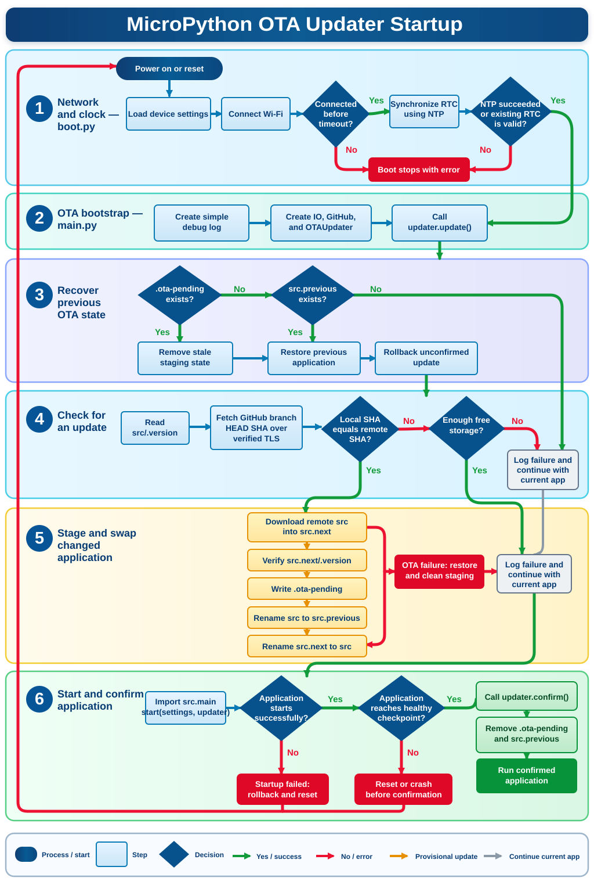

# MicroPython OTA Updater

An application-file updater for MicroPython devices. It follows a GitHub
branch, downloads a changed `src` tree into a staging directory, and swaps it
into place after the download succeeds.

This project updates Python application files. Firmware upgrades are performed
from a host with `make flash`; it does not rewrite the MicroPython firmware over
the air.



## Supported platform

| Board profile | MicroPython | Status |
| --- | --- | --- |
| `ESP32_GENERIC` | `v1.28.0` (2026-04-06) | Production |
| MicroPython development branch | Latest preview | Non-blocking weekly compiler check |

Firmware and board instructions are published on the
[official ESP32_GENERIC download page](https://micropython.org/download/ESP32_GENERIC/).

The firmware URL and SHA-256 checksum are pinned in
`firmware/manifest.json`. Other ESP32 variants must be added with their own
firmware filename, flash address, checksum, and hardware validation before they
are described as supported.

## Quick start

This path installs the updater on one `ESP32_GENERIC` board and starts a minimal
application from GitHub.

### 1. Create the application repository

Open the
[`micropython-ota-quickstart` template](https://github.com/smysnk/micropython-ota-quickstart/generate),
choose **Create a new repository**, and create a public repository. The template
already contains the required `src/main.py` and `start(settings, updater)`
entrypoint.

### 2. Install the host tools

```sh
git clone https://github.com/smysnk/micropython-ota-updater.git
cd micropython-ota-updater

python3 -m venv .venv
. .venv/bin/activate
make install
```

### 3. Configure the device

```sh
cp device/env.example.py device/env.local.py
```

Change these four values in `device/env.local.py`:

```python
'wifiAP': 'YOUR_WIFI_NAME',
'wifiPassword': 'YOUR_WIFI_PASSWORD',
'githubRemote': 'https://github.com/YOUR_NAME/YOUR_APPLICATION',
'githubRemoteBranch': 'main',
```

### 4. Flash and deploy

Connect one ESP32 over USB and confirm that `mpremote` can see it:

```sh
python -m mpremote devs
```

> **Warning:** `erase` removes the existing firmware and every file on the
> selected device.

With one compatible board connected, automatic port detection is usually
enough:

```sh
make erase flash deploy SERIAL_PORT=auto
make repl SERIAL_PORT=auto
```

The REPL should begin printing:

```text
ota-controller: OTA application started
ota-controller: heartbeat 1
ota-controller: heartbeat 2
```

### 5. Publish an update

Edit `src/main.py` in the application repository created from the template,
commit it, and push it to GitHub. Press the board's reset button or enter
`Ctrl-D` in the REPL. The updater will install the new branch commit and retain
the previous application until the new version calls `updater.confirm()`.

The sections below cover development, private repositories, explicit serial
ports, rollout branches, recovery, and validation in more detail.

## Development

```sh
python3 -m venv .venv
. .venv/bin/activate
make install-dev
make test-python
make test-mpy
```

`make test-python` runs the host-side unit and failure-injection tests.
`make test-mpy` compiles every device module with MicroPython 1.28 `mpy-cross`.
`make test` produces the Test Station report in `artifacts/test-station/`.

The network-dependent certificate-chain check is separate:

```sh
make test-live-tls
```

## Configure a device

Create the ignored local configuration from the one tracked schema:

```sh
cp device/env.example.py device/env.local.py
```

Edit `device/env.local.py`, then deploy it. A fine-grained GitHub token is
optional for public repositories and should have read-only access to the
application repository. Tokens are sent with Bearer authentication.

The bundled CA roots validate `api.github.com` and
`raw.githubusercontent.com`. They intentionally reject unrecognised HTTPS
hosts. Certificate fingerprints and expiry dates must be reviewed during every
release; see `docs/RELEASE_CHECKLIST.md`.

## Flash and deploy

The commands use `esptool` and the officially supported `mpremote` utility.

```sh
# Destructive: erases firmware and all files on the device.
make erase SERIAL_PORT=/dev/cu.usbserial-0001

# Downloads the pinned artifact, verifies SHA-256, and flashes it.
make flash SERIAL_PORT=/dev/cu.usbserial-0001

# Copies the updater and local configuration, then performs a soft reset.
make deploy SERIAL_PORT=/dev/cu.usbserial-0001

make repl SERIAL_PORT=/dev/cu.usbserial-0001
make smoke-test SERIAL_PORT=/dev/cu.usbserial-0001
```

`make firmware` downloads without flashing, while `make verify-firmware`
rechecks an existing image. Board, artifact, chip, baud, and flash-address
metadata are read exclusively from `firmware/manifest.json`.

## Application contract

The GitHub application repository must contain a `src` directory with a
`main.py` module exposing `start`:

```python
import machine
import time


def start(settings, updater):
  # Optional: a reset before confirmation restores src.previous on next boot.
  watchdog = machine.WDT(timeout=60000) if settings.get('watchdog') else None

  # Perform enough initialization to know this version can run, then confirm.
  updater.confirm()

  # Enter the application's normal loop.
  while True:
    if watchdog:
      watchdog.feed()
    time.sleep(1)
```

Confirmation is important. Until `updater.confirm()` runs, the previous
application remains in `src.previous` and `.ota-pending` marks the new version
as unconfirmed. If the device resets first, the next boot restores the previous
application. An exception raised while importing or starting the new
application also triggers rollback and reset.

HTTP, logging, and time are application concerns in version 3. Import the
standard MicroPython modules the application needs instead of expecting the
bootstrap to inject wrappers.

## Rollout branches

The updater already treats its configured GitHub branch head as the deployment
checkpoint. A repository can use `ota-preview` and `ota-stable` branches for
rollout rings without adding release-selection code to the device. Point test
devices at `ota-preview`; after validation, fast-forward `ota-stable` to the
tested commit. Devices store and compare the resolved commit SHA.

## Update sequence

1. Recover any interrupted or unconfirmed previous update.
2. Compare `src/.version` with the current GitHub branch SHA.
3. Check free filesystem space and download into `src.next`.
4. Write and read back `src.next/.version`.
5. Create `.ota-pending`, rename `src` to `src.previous`, and rename
   `src.next` to `src`.
6. Start the application. The application calls `updater.confirm()` when its
   critical initialization has succeeded.

The updater streams file bodies in 512-byte chunks, closes responses on all
handled failures, verifies TLS hostnames and certificate chains, and leaves the
current application untouched if staging fails.

## Recovery

Automatic recovery is conservative: an update with both `.ota-pending` and
`src.previous` is rolled back at the beginning of the next updater run. For
manual inspection:

```sh
mpremote connect /dev/cu.usbserial-0001 fs tree -sh :
mpremote connect /dev/cu.usbserial-0001 fs cat :.ota-pending
```

Do not remove `src.previous` while `.ota-pending` exists. Full recovery steps
and the migration notes from the earlier release are in `docs/UPGRADING.md`.

## CI and hardware validation

Normal CI runs CPython tests and compiles with the stable MicroPython compiler.
A scheduled/manual job compiles against MicroPython's development branch and is
non-blocking. The `ESP32 hardware smoke test` workflow is manual and requires a
self-hosted runner labelled `micropython-esp32`; it erases and flashes the
attached board, deploys the updater, verifies GitHub TLS, and tests a reboot.

Hardware workflow configuration:

- Secrets: `OTA_WIFI_AP`, `OTA_WIFI_PASSWORD`, optionally `OTA_GITHUB_TOKEN`.
- Variables: `OTA_GITHUB_REMOTE`, optionally `OTA_GITHUB_BRANCH`.

Version 3 migration details, including removed interfaces and the known
downstream consumer, are in `docs/UPGRADING.md`.
